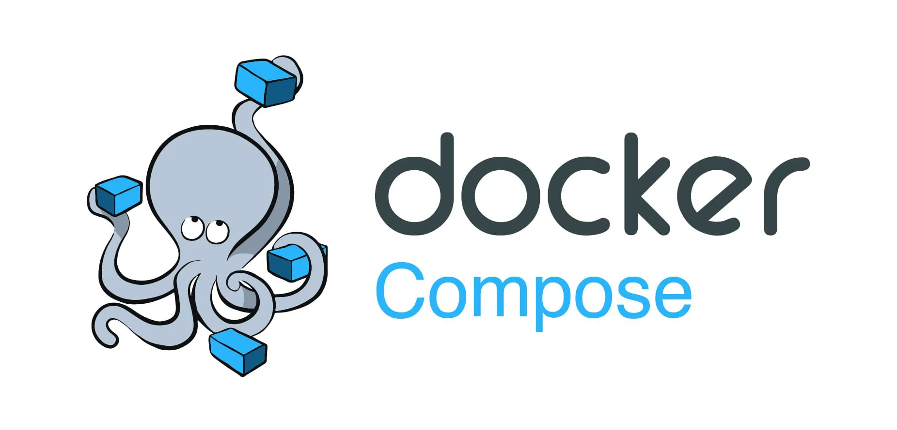

# [Docker Compose Getting Started](https://docs.docker.com/compose/gettingstarted/)



## Requirements

1. Create a directory for the project:
```bash
mkdir composetest
cd composetest
```
2. Create a file called app.py in your project directory
```python
import time

import redis
from flask import Flask

app = Flask(__name__)
cache = redis.Redis(host='redis', port=6379)

def get_hit_count():
    retries = 5
    while True:
        try:
            return cache.incr('hits')
        except redis.exceptions.ConnectionError as exc:
            if retries == 0:
                raise exc
            retries -= 1
            time.sleep(0.5)

@app.route('/')
def hello():
    count = get_hit_count()
    return 'Hello World! I have been seen {} times.\n'.format(count)
```
3. Create another file called requirements.txt in your project directory
```txt
flask
redis
```

## Dockerfile

4. In your project directory, create a file named Dockerfile
```Dockerfile
# syntax=docker/dockerfile:1
FROM python:3.7-alpine
WORKDIR /code
ENV FLASK_APP=app.py
ENV FLASK_RUN_HOST=0.0.0.0
RUN apk add --no-cache gcc musl-dev linux-headers
COPY requirements.txt requirements.txt
RUN pip install -r requirements.txt
EXPOSE 5000
COPY . .
CMD ["flask", "run"]
```

## Docker Compose

5. Create a file called docker-compose.yml in your project directory
```yaml
version: "3.9"
services:
  web:
    build: .
    ports:
      - "8000:5000"
  redis:
    image: "redis:alpine"
```
6. From your project directory, start up your application by running docker compose up.
```bash
docker compose up
```
7. Enter http://localhost:8000/ in a browser to see the application running
8. Stop the application, by running docker compose down from within your project directory
```bash
docker compose down
```

## Bind Mount

9. Edit docker-compose.yml in your project directory to add a bind mount for the web service
```yaml
version: "3.9"
services:
  web:
    build: .
    ports:
      - "8000:5000"
    volumes:
      - .:/code
    environment:
      FLASK_DEBUG: True
  redis:
    image: "redis:alpine"
```
10. Re-build and run the app with Compose
```bash
docker compose up
```
11. Change the greeting in app.py and save it. For example, change the Hello World! message to Hello from Docker!
```python
return 'Hello from Docker! I have been seen {} times.\n'.format(count)
```